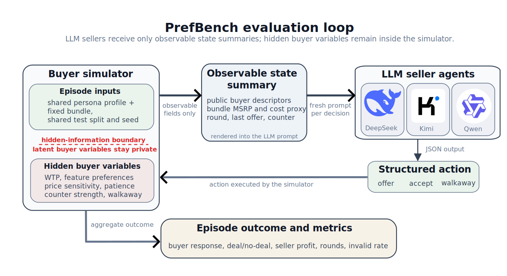

# PrefBench

PrefBench is a simulator-based benchmark for evaluating seller-side agents in hidden-preference personalized pricing negotiations. A seller must price a customized product bundle while observing only a partial state summary of the buyer. The benchmark separates three capabilities that are often conflated in LLM-agent evaluation: producing valid structured actions, reaching agreements, and making profit-sensitive pricing decisions when buyer preferences are not directly observable.

This repository provides the code and data artifacts for PrefBench, including the negotiation simulator, a fixed vehicle-customization catalog, deterministic persona splits, heuristic baselines, OpenAI-compatible LLM runners, and evaluation scripts used to produce the benchmark metrics shown below.



## Benchmark Setting

PrefBench defines a controlled negotiation environment with four main components:

- **Hidden-preference buyers.** Each episode is grounded in observable buyer attributes and simulator-private variables such as willingness to pay, preference weights, patience, and counter-offer behavior.
- **Customized product bundles.** The benchmark uses a fixed Mercedes-Benz E350 customization catalog as a concrete pricing substrate.
- **Multi-round seller actions.** A seller may make an offer, accept a buyer counter-offer, or walk away. Outcomes are scored by deal completion, seller profit, rounds used, walkaway behavior, and invalid action rates.
- **Shared evaluation protocol.** Heuristic and LLM agents are evaluated on the same persona splits, catalog, simulator transition logic, action schema, and metrics.

The vehicle-customization setting is one reproducible instance of a broader problem: evaluating pricing agents when buyer preferences are partially hidden and agreement alone is not the objective.

## Repository Structure

```text
PrefBench/
├── assets/                       # Figures used by this README
├── catalog/                      # Fixed vehicle-customization catalog
├── configs/                      # Persona, hidden-preference, and LLM configs
├── datasets/                     # Public test split and LLM evaluation subset
├── scripts/
│   ├── agents/                   # Heuristic and LLM benchmark runners
│   ├── analysis/                 # Result summarization utilities
│   └── data/                     # Persona-bank and subset generation scripts
├── src/
│   ├── pricing_env/              # Simulator, WTP model, personas, NegMAS backend
│   └── pricing_agent/            # Heuristic policies and LLM interface
├── requirements.txt
└── README.md
```

Generated reports, traces, prompts, API-key configs, local notes, and local drafts are not tracked. Experiment outputs are written under `artifacts/` by default, and local LLM credentials should be stored in `configs/llm_api.local.json`.

## Installation

Prerequisites:

- Linux or macOS
- Python 3.10
- Conda or another Python environment manager

Create an environment and install dependencies:

```bash
conda create -n prefbench python=3.10 -y
conda activate prefbench
python -m pip install --upgrade pip
pip install -r requirements.txt
```

## Data

The repository contains the fixed resources needed to run the main benchmark commands:

- `catalog/e350_core_catalog.yaml`: fixed customization catalog.
- `configs/personas_v2.yaml`: persona generation entry config.
- `configs/us_buyer_distribution_v2.yaml`: observable buyer-profile distribution.
- `configs/persona_hidden_mapping_v1.yaml`: mapping from observable profiles to hidden preference and behavior variables.
- `datasets/persona_bank/bank50k_s123/test.jsonl`: 7,500-episode held-out test split.
- `datasets/persona_bank/bank50k_s123/llm_test_500.jsonl`: fixed 500-episode subset for cost-controlled LLM evaluation.

Large train, validation, and combined persona-bank files are not tracked to keep the repository lightweight.

## Heuristic Baselines

Run the checkpoint-free reference policies on the full held-out test split:

```bash
python scripts/agents/run_benchmark.py \
  --episodes 7500 \
  --seed 123 \
  --persona-bank-path datasets/persona_bank/bank50k_s123/test.jsonl \
  --persona-bank-split test \
  --policies random,concession \
  --run-name heuristic_test \
  --report-out artifacts/heuristic/full_test7500/report.json \
  --episodes-out artifacts/heuristic/full_test7500/episodes.jsonl
```

The heuristic runners use the same simulator, persona stream, and hidden-state boundary as the LLM runners. The concession policy is a non-learned reference that starts from an anchored offer and concedes toward a floor over seller turns.

## LLM Agents

The LLM runner calls an OpenAI-compatible `/chat/completions` endpoint. Copy the example config and fill in a local provider configuration:

```bash
cp configs/llm_api.example.json configs/llm_api.local.json
```

`configs/llm_api.local.json` is gitignored so API keys are not committed. Each entry under `runs` defines one provider-facing model configuration.

Run one named LLM configuration on the fixed 500-episode subset:

```bash
python scripts/agents/run_llm_benchmark.py \
  --api-config configs/llm_api.local.json \
  --llm-run-name deepseek_v4_flash \
  --prompt-version v1 \
  --episodes 500 \
  --persona-bank-path datasets/persona_bank/bank50k_s123/llm_test_500.jsonl \
  --report-out artifacts/llm/deepseek_v4_flash_llm_test_500.json
```

The LLM receives a rendered observable state summary and must return one JSON object with a supported `move`. The parser requires `price_offer_usd` only for offer actions. Malformed JSON, unsupported moves, missing offer prices, non-numeric offer prices, and negative offer prices are counted as invalid LLM outputs. The runner does not replace invalid outputs with fallback actions.

The summary report stores aggregate metrics. Sidecar JSONL files derived from `--report-out` store per-episode records, traces, and prompts, for example `*_episodes.jsonl`, `*_trace.jsonl`, and `*_prompts.jsonl`. Long LLM runs flush these files periodically and can resume from completed episode rows when the same output paths are reused.

## Result Snapshot

The table below reports representative full-test results on the fixed 7,500-episode held-out split. LLM agents are evaluated zero-shot with prompt version `v1`; heuristic policies are evaluated under the same simulator, episode seeds, action schema, and hidden-information boundary.

| Policy | Deal rate | Avg. profit (USD) | Avg. rounds | Walkaway rate | Invalid rate |
| --- | ---: | ---: | ---: | ---: | ---: |
| Random | 0.5769 | 6,572.33 | 1.3541 | 0.4231 | 0.0000 |
| Concession heuristic | 0.7268 | 14,774.11 | 1.7123 | 0.2732 | 0.0000 |
| DeepSeek V4 Flash | 0.9903 | 6,749.21 | 1.0313 | 0.0097 | 0.0000 |
| Kimi K2.6 | 1.0000 | 4,514.43 | 1.0000 | 0.0000 | 0.0000 |
| Qwen3.6 Plus | 0.9985 | 5,979.55 | 1.0036 | 0.0015 | 0.0000 |

These results illustrate the benchmark's diagnostic separation: zero-shot LLM agents can produce valid structured actions and close deals at high rates, while still earning substantially lower seller profit than a simple concession heuristic. PrefBench therefore evaluates strategic pricing quality, not only language-interface compliance or agreement seeking.

## Code and Data Availability

This repository accompanies the PrefBench arXiv paper. It includes the simulator, benchmark runners, fixed public test split, fixed LLM evaluation subset, catalog and persona configs, reference heuristic baselines, OpenAI-compatible LLM evaluation code, and scripts for reproducing aggregate metrics.

The repository does not include provider API keys, local experiment outputs, large train/validation persona-bank files, local notes, or local drafts.

## Paper and Citation

The PrefBench paper is available on arXiv:

- [PrefBench: Evaluating Zero-Shot LLM Agents in Hidden-Preference Personalized Pricing Negotiations](https://arxiv.org/abs/2605.22855)

If you use the benchmark code or data, please cite:

```bibtex
@misc{lei2026prefbenchevaluatingzeroshotllm,
      title={PrefBench: Evaluating Zero-Shot LLM Agents in Hidden-Preference Personalized Pricing Negotiations}, 
      author={Yingjie Lei},
      year={2026},
      eprint={2605.22855},
      archivePrefix={arXiv},
      primaryClass={cs.GT},
      url={https://arxiv.org/abs/2605.22855}, 
}
```

## Acknowledgements

PrefBench builds on or interfaces with:

- [NegMAS](https://github.com/yasserfarouk/negmas) for negotiation mechanism support.
- [PyYAML](https://pyyaml.org/) and standard Python tooling for reproducible configuration, simulation, and data generation.

The customization catalog is derived from publicly available Mercedes-Benz E350 configuration information and is used only as a research benchmark anchor. Mercedes-Benz and related model names remain the property of their respective owners. This project is not affiliated with, endorsed by, or sponsored by Mercedes-Benz.

## License

This project is distributed under the MIT License. See [LICENSE](LICENSE) for details.
